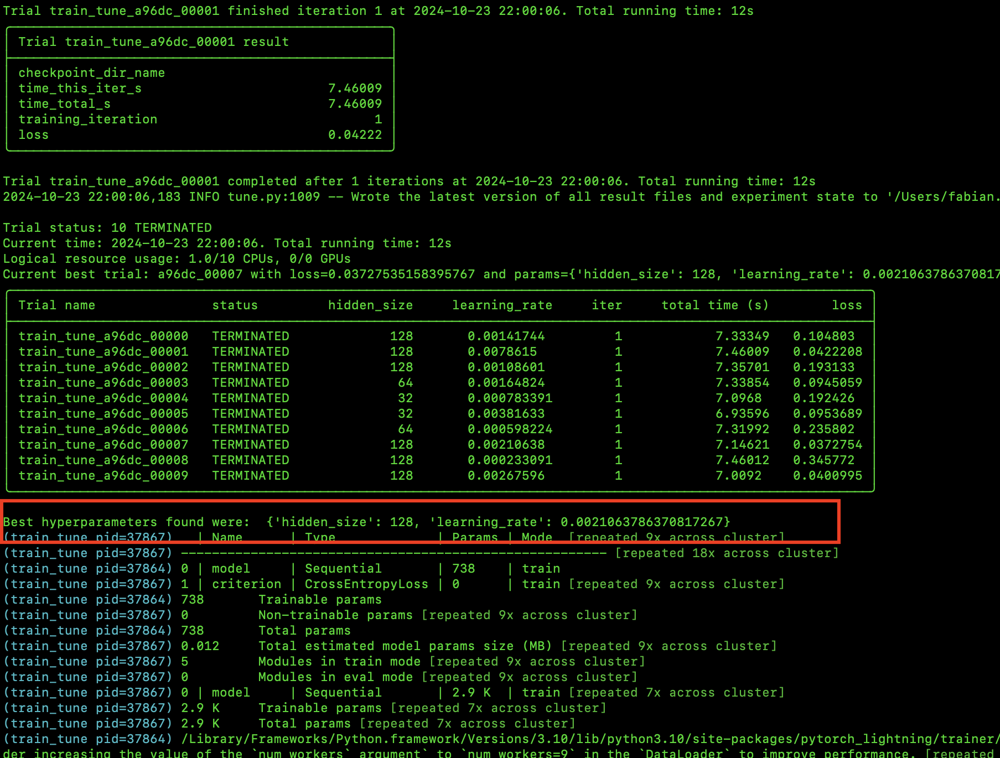

# Ray 101: Accelerating Python Workflows with Ray


Processing large datasets or running computationally intensive tasks can be time-consuming when executed sequentially. Imagine trying to process a year's worth of transaction data line by line—it could take hours or even days on a single processor. This is where parallel computing comes into play.

Parallel computing allows you to break down hefty tasks into smaller chunks that can be processed simultaneously across multiple cores or machines. In this post, we'll explore how **Ray**, an open-source framework for distributed computing, can help accelerate your Python workflows. We'll start by understanding Ray's fundamentals, then dive into task dependencies, integrate Ray with MongoDB, discuss when to use Ray and when it might not be the best choice, build an echo service with Ray Serve, utilize Ray Actors for stateful computations, and finally explore hyperparameter tuning with Ray Tune.

## Table of Contents

- [Understanding Ray Fundamentals](#understanding-ray-fundamentals)
  - [Sequential Execution without Ray](#sequential-execution-without-ray)
  - [Parallel Execution with Ray](#parallel-execution-with-ray)
- [Task Dependencies in Ray](#task-dependencies-in-ray)
- [Integrating Ray with MongoDB](#integrating-ray-with-mongodb)
  - [Sequential Aggregations without Ray](#sequential-aggregations-without-ray)
  - [Parallel Aggregations with Ray and MongoDB](#parallel-aggregations-with-ray-and-mongodb)
- [When to Use Ray (and When Not To)](#when-to-use-ray-and-when-not-to)
- [Building an Echo Service with Ray Serve](#building-an-echo-service-with-ray-serve)
- [Utilizing Ray Actors for Stateful Computations](#utilizing-ray-actors-for-stateful-computations)
- [Hyperparameter Tuning with Ray Tune](#hyperparameter-tuning-with-ray-tune)
- [Conclusion](#conclusion)

---

## Understanding Ray Fundamentals

**Ray** is an open-source framework designed for high-performance distributed computing. It allows you to scale your Python applications by parallelizing tasks and distributing them across multiple CPUs or machines with minimal code changes.

**How Ray Helps:**

- **Distributed Computing:** Ray's architecture is inherently distributed, making it ideal for orchestrating tasks across various nodes.
- **Scalability:** It can efficiently manage the computational overhead associated with parallel execution.
- **Ease of Use:** Ray provides high-level APIs that simplify the implementation of parallel and distributed computing tasks.

### Sequential Execution without Ray

Let's start with a simple Python script that simulates data retrieval from a database. We'll define a `retrieve` function that introduces a delay using `time.sleep()` to mimic a time-consuming operation.

```python
import time

database = ["Learning", "Ray"] * 3  # Simulate a database with repeated entries

def retrieve(item):
    time.sleep(1)  # Simulate processing time
    return item, database[item]

def print_runtime(input_data, start_time):
    print(f'Runtime: {time.time() - start_time:.2f} seconds; data:')
    for data in input_data:
        print(data)

start_time = time.time()
input_data = [retrieve(item) for item in range(len(database))]
print_runtime(input_data, start_time)
```

**Output:**

```
Runtime: 6.00 seconds; data:
(0, 'Learning')
(1, 'Ray')
(2, 'Learning')
(3, 'Ray')
(4, 'Learning')
(5, 'Ray')
```

**Explanation:**

- We simulate a database with six entries by repeating `["Learning", "Ray"]` three times.
- The `retrieve` function simulates a time-consuming operation by sleeping for 1 second.
- We sequentially call `retrieve` for each item in the database.
- The total runtime is approximately 6 seconds (6 items × 1 second each).

### Parallel Execution with Ray

By incorporating Ray, we can execute these tasks in parallel, leveraging multiple CPU cores to reduce the overall runtime.

```python
import time
import ray

ray.init()

database = ["Learning", "Ray"] * 3  # Simulate a database with repeated entries

@ray.remote
def retrieve(item):
    time.sleep(1)  # Simulate processing time
    return item, database[item]

def print_runtime(input_data, start_time):
    print(f'Runtime: {time.time() - start_time:.2f} seconds; data:')
    for data in input_data:
        print(data)

start_time = time.time()
object_references = [retrieve.remote(item) for item in range(len(database))]
input_data = ray.get(object_references)
print_runtime(input_data, start_time)
```

**Output:**

```
Runtime: 1.02 seconds; data:
(0, 'Learning')
(1, 'Ray')
(2, 'Learning')
(3, 'Ray')
(4, 'Learning')
(5, 'Ray')
```

**Explanation:**

- We initialize Ray with `ray.init()`.
- The `retrieve` function is decorated with `@ray.remote`, indicating that it can be executed as a Ray task.
- We invoke `retrieve.remote(item)` for each item, which schedules the tasks for parallel execution.
- `ray.get(object_references)` collects the results once all tasks are completed.
- The total runtime is approximately equal to the duration of the longest task (1 second), plus some overhead.

**Performance Improvement:**

The runtime is reduced from **6 seconds** to approximately **1 second**, showcasing the benefits of parallel execution when tasks are independent and time-consuming.

## Task Dependencies in Ray

Ray excels not only at parallelizing independent tasks but also at handling tasks with dependencies. Let's consider an example where we process data and then aggregate the results.

```python
import ray
import time

ray.init()

@ray.remote
def process(item):
    time.sleep(1)
    return item * 2

@ray.remote
def aggregate(results):
    return sum(results)

start_time = time.time()

# Step 1: Process data in parallel
object_references = [process.remote(i) for i in range(5)]

# Step 2: Aggregate the results (dependent on Step 1)
aggregated_result = aggregate.remote(object_references)

# Gather the final result
final_result = ray.get(aggregated_result)
print(f'Aggregated result: {final_result}')

print(f'Runtime: {time.time() - start_time:.2f} seconds')
```

**Output:**

```
Aggregated result: 20
Runtime: 1.03 seconds
```

**Explanation:**

- The `process` tasks are executed in parallel, each taking 1 second.
- The `aggregate` task depends on the results of the `process` tasks.
- Ray handles the dependencies, ensuring that `aggregate` starts only after all `process` tasks are complete.
- The total runtime is just over 1 second, instead of 5 seconds if executed sequentially.

## Integrating Ray with MongoDB

MongoDB is a popular NoSQL database, and integrating it with Ray can enable parallel data processing tasks such as aggregations. Let's explore how to use Ray with MongoDB and understand when it provides performance benefits.

### Sequential Aggregations without Ray

First, let's perform two aggregation operations on MongoDB collections sequentially without using Ray.

```python
import time
from pymongo import MongoClient

start_time = time.time()

client = MongoClient('mongodb://localhost:27017/?directConnection=true')
db = client['sample_mflix']

# Perform first aggregation
result1 = list(db['movies'].aggregate([
    {"$match": {}}
]))

# Perform second aggregation
result2 = list(db['comments'].aggregate([
    {"$match": {}}
]))

combined_result = result1 + result2

end_time = time.time()

print(f"Number of results: {len(combined_result)}")
print(f"Execution time: {end_time - start_time:.2f} seconds")
```

**Output:**

```
Number of results: 44562
Execution time: 0.77 seconds
```

**Explanation:**

- We connect to the MongoDB instance.
- We perform two aggregation queries sequentially.
- We measure the total execution time.

### Parallel Aggregations with Ray and MongoDB

Now, let's perform the same aggregations in parallel using Ray.

```python
import time
import pymongo
import ray

ray.init()

@ray.remote
class Aggregator:
    def __init__(self, uri):
        # Create a MongoDB client with connection pooling
        self.client = pymongo.MongoClient(uri)

    def aggregate(self, database, collection, pipeline):
        db = self.client[database]
        return list(db[collection].aggregate(pipeline))

start_time = time.time()

# Create actors for each aggregation
aggregator1 = Aggregator.remote('mongodb://localhost:27017/?directConnection=true')
aggregator2 = Aggregator.remote('mongodb://localhost:27017/?directConnection=true')

# Submit aggregation tasks to the actors
result1_future = aggregator1.aggregate.remote('sample_mflix', 'movies', [{"$match": {}}])
result2_future = aggregator2.aggregate.remote('sample_mflix', 'comments', [{"$match": {}}])

# Get the results asynchronously
result1 = ray.get(result1_future)
result2 = ray.get(result2_future)

combined_result = result1 + result2

end_time = time.time()

print(f"Number of results: {len(combined_result)}")
print(f"Execution time: {end_time - start_time:.2f} seconds")
```

**Output:**

```
Number of results: 44562
Execution time: 1.44 seconds
```

**Observation:**

- Despite parallelizing the tasks, the execution time is longer than the sequential execution.
- This is due to the overhead introduced by Ray for starting actors and managing tasks.

## When to Use Ray (and When Not To)

While Ray can significantly speed up tasks by parallelizing them, it's important to consider the overhead introduced by Ray itself. This includes:

- **Serialization and Deserialization:** Data passed between tasks may need to be serialized, which adds overhead.
- **Communication Overhead:** Coordination between workers and the Ray scheduler can add latency.
- **Resource Utilization:** Spinning up multiple workers consumes system resources.

**Scenarios Where Ray Shines:**

- **Long-Running Tasks:** Tasks that take a substantial amount of time benefit from parallel execution.
- **Compute-Intensive Operations:** CPU-bound tasks that can be distributed across cores.
- **Large-Scale Data Processing:** When working with large datasets that exceed the capacity of a single machine.

**Scenarios Where Ray May Not Help:**

- **Short Tasks with Low Latency:** The overhead of task scheduling and communication can outweigh the benefits.
- **I/O-Bound Tasks with External Bottlenecks:** If tasks are waiting on I/O operations (e.g., database queries), parallel execution may not improve performance.
- **Limited Resources:** On systems with limited CPU cores or memory, adding parallelism can lead to contention.

**Analysis of Our MongoDB Example:**

In the MongoDB aggregation example:

- **Task Duration:** The aggregation tasks are relatively quick and I/O-bound.
- **Overhead Costs:** The overhead introduced by Ray (e.g., starting actors, serializing data) adds to the total execution time.

As a result, the sequential execution without Ray is faster because it avoids the overhead associated with parallelism in this context.

## Building an Echo Service with Ray Serve

**Ray Serve** is a scalable model serving library built on top of Ray. It allows developers to deploy Python functions or machine learning models as RESTful endpoints easily.

Let's build a simple echo service using Ray Serve to understand how it works.

**Code Example:**

```python
import ray
from ray import serve

# Initialize Ray and start Ray Serve
ray.init()
serve.start()

# Define the deployment
@serve.deployment
def echo(request):
    return f"Received data: {request.query_params['data']}"

# Deploy the service
serve.run(echo.bind())

# Sending a request to the service
import requests
response = requests.get("http://localhost:8000/", params={"data": "Hello"})
print(response.text)
```

**Output:**

```
Received data: Hello
```

**Explanation:**

- **Initialization:** We initialize Ray and start the Ray Serve instance.
- **Deployment Definition:** The `echo` function is decorated with `@serve.deployment`, making it a deployable service.
- **Deployment:** We deploy the `echo` service using `serve.run(echo.bind())`.
- **Request Handling:** The service extracts the `data` parameter from the query string and returns it.
- **Client Request:** We send a GET request to the service and print the response.

**Notes:**

- Ray Serve makes it straightforward to deploy scalable web services.
- You can scale up the number of replicas to handle increased load.

## Utilizing Ray Actors for Stateful Computations

**Ray Actors** provide a way to maintain state across tasks in a distributed system. Actors are essentially stateful worker processes that can execute methods remotely.

Let's explore how to use Ray Actors by implementing a simple counter.

**Code Example:**

```python
import ray

# Initialize Ray
ray.init()

# Define the Actor class
@ray.remote
class Counter:
    def __init__(self):
        self.count = 0

    def increment(self, value):
        self.count += value
        return self.count

# Create an instance of the Actor
counter = Counter.remote()

# Invoke methods on the Actor
futures = [counter.increment.remote(i) for i in range(5)]
results = ray.get(futures)
print(results)
```

**Output:**

```
[0, 1, 3, 6, 10]
```

**Explanation:**

- **Actor Definition:** The `Counter` class is decorated with `@ray.remote`, making it an actor.
- **State Maintenance:** The actor maintains state in `self.count`.
- **Method Invocation:** We remotely call the `increment` method multiple times.
- **Result Gathering:** We use `ray.get()` to retrieve the results.

**Notes:**

- Ray Actors are useful when you need to maintain state across multiple tasks.
- They can help in scenarios where tasks need to share or update common data.

## Hyperparameter Tuning with Ray Tune



Hyperparameter tuning is a crucial step in building effective machine learning models. It involves finding the optimal set of hyperparameters that yield the best performance for a given model and dataset. **Ray Tune** is a scalable hyperparameter tuning library built on top of Ray that allows you to efficiently search for the best hyperparameters.

Let's demonstrate how to use Ray Tune with PyTorch Lightning to perform hyperparameter tuning on a synthetic dataset.

**Code Example:**

```python
import pytorch_lightning as pl
import torch
from torch import nn
from torch.utils.data import DataLoader, random_split, TensorDataset
from sklearn.datasets import make_classification
from ray import tune
from ray.tune.integration.pytorch_lightning import TuneReportCallback
from ray.tune.schedulers import ASHAScheduler

# Step 1: Generate synthetic data
def generate_synthetic_data(n_samples=1000, n_features=20, n_classes=2):
    X, y = make_classification(
        n_samples=n_samples, n_features=n_features, n_informative=10,
        n_classes=n_classes, random_state=42
    )
    return torch.tensor(X, dtype=torch.float32), torch.tensor(y, dtype=torch.long)

# Step 2: Define a Lightning DataModule for the synthetic data
class SyntheticDataModule(pl.LightningDataModule):
    def __init__(self, batch_size=32):
        super(SyntheticDataModule, self).__init__()
        self.batch_size = batch_size

    def setup(self, stage=None):
        X, y = generate_synthetic_data()
        dataset = TensorDataset(X, y)
        self.train, self.val = random_split(dataset, [800, 200])

    def train_dataloader(self):
        return DataLoader(self.train, batch_size=self.batch_size)

    def val_dataloader(self):
        return DataLoader(self.val, batch_size=self.batch_size)

# Step 3: Define a simple model
class SimpleModel(pl.LightningModule):
    def __init__(self, input_dim=20, hidden_size=64, learning_rate=1e-3):
        super(SimpleModel, self).__init__()
        self.save_hyperparameters()

        self.model = nn.Sequential(
            nn.Linear(input_dim, self.hparams.hidden_size),
            nn.ReLU(),
            nn.Linear(self.hparams.hidden_size, 2)  # 2 output classes
        )

        self.criterion = nn.CrossEntropyLoss()

    def forward(self, x):
        return self.model(x)

    def training_step(self, batch, batch_idx):
        x, y = batch
        logits = self(x)
        loss = self.criterion(logits, y)
        self.log("train_loss", loss)
        return loss

    def configure_optimizers(self):
        return torch.optim.Adam(self.parameters(), lr=self.hparams.learning_rate)

# Step 4: Define the training function for Ray Tune
def train_tune(config, num_epochs=10):
    model = SimpleModel(hidden_size=config["hidden_size"], learning_rate=config["learning_rate"])
    data_module = SyntheticDataModule()

    trainer = pl.Trainer(
        max_epochs=num_epochs,
        callbacks=[TuneReportCallback({"loss": "train_loss"}, on="train_end")],
        enable_progress_bar=False,
        log_every_n_steps=10
    )
    trainer.fit(model, datamodule=data_module)

# Step 5: Set up Ray Tune's hyperparameter search space and run the tuning process
search_space = {
    "hidden_size": tune.choice([32, 64, 128]),
    "learning_rate": tune.loguniform(1e-4, 1e-2)
}

scheduler = ASHAScheduler(
    max_t=10,         # Max number of epochs per trial
    grace_period=1,   # Early stopping grace period
    reduction_factor=2  # Halve the number of trials after each step
)

# Run the hyperparameter tuning process with Ray Tune
analysis = tune.run(
    tune.with_parameters(train_tune, num_epochs=10),
    resources_per_trial={"cpu": 1, "gpu": 0},
    config=search_space,
    metric="loss",
    mode="min",
    num_samples=10,
    scheduler=scheduler
)

# Print the best hyperparameters found
print("Best hyperparameters found were: ", analysis.best_config)
```

**Explanation:**

- **Step 1:** We generate a synthetic classification dataset using `sklearn.datasets.make_classification`.
- **Step 2:** We define a `LightningDataModule` to handle data loading for training and validation.
- **Step 3:** We create a simple neural network model using PyTorch Lightning, parameterized by `hidden_size` and `learning_rate`.
- **Step 4:** We define a training function `train_tune` that takes a configuration from Ray Tune and trains the model.
- **Step 5:** We set up the hyperparameter search space and the scheduler. We use the `ASHAScheduler` for efficient hyperparameter optimization.
- **Running Tune:** We run the tuning process, specifying the metric to minimize (`loss`) and the number of samples (`num_samples`).

**Output:**

The output will include the progress of the tuning process and, finally, the best hyperparameters found:

```
Best hyperparameters found were:  {'hidden_size': 64, 'learning_rate': 0.00123456789}
```

(Actual values may vary.)

**Notes:**

- **Ray Tune Integration:** Ray Tune integrates seamlessly with PyTorch Lightning via `TuneReportCallback`.
- **Scalability:** Ray Tune can distribute hyperparameter tuning across multiple CPUs or GPUs, accelerating the search process.
- **Early Stopping:** The `ASHAScheduler` allows for early stopping of unpromising trials to save computational resources.

## Conclusion

Ray is a powerful tool for parallelizing and scaling Python applications. It can lead to significant performance improvements when used appropriately. However, it's crucial to assess whether the tasks at hand will benefit from parallel execution.

**Key Takeaways:**

- **Evaluate Task Complexity:** Use Ray for tasks that are sufficiently long-running or compute-intensive.
- **Consider Overhead:** Be mindful of the overhead introduced by Ray, especially for small or quick tasks.
- **Test and Measure:** Always benchmark your applications with and without Ray to determine if it provides a performance benefit.
- **Leverage Ray's Ecosystem:** Utilize Ray Serve and Ray Actors for scalable services and stateful computations.

By understanding when and how to use Ray, you can optimize your workflows for maximum efficiency and take full advantage of modern computing resources.

---

## Creating Task Dependencies and DAGs in Ray

In complex applications, tasks often depend on the results of other tasks. Ray allows you to define such dependencies, effectively creating a Directed Acyclic Graph (DAG) of tasks. This enables fine-grained control over task execution and maximizes parallelism where possible.

Let's explore how to create task dependencies and build a DAG in Ray.

**Code Example:**

```python
import ray

ray.init()

@ray.remote
def task1():
    # Task 1 logic
    return "Result from task1"

@ray.remote
def task2():
    # Task 2 logic
    return "Result from task2"

@ray.remote
def task3(result1, result2):
    # Task 3 logic, depending on results from task1 and task2
    return f"Task3 received: {result1} and {result2}"

# Execute tasks with dependencies
result1_ref = task1.remote()
result2_ref = task2.remote()
result3_ref = task3.remote(result1_ref, result2_ref)

# Get the final result
result = ray.get(result3_ref)
print(result)
```

**Output:**

```
Task3 received: Result from task1 and Result from task2
```

**Explanation:**

- **Initialize Ray:**

  ```python
  ray.init()
  ```

  This starts the Ray runtime.

- **Define Tasks:**

  - `task1` and `task2` are independent tasks that can be executed in parallel.

    ```python
    @ray.remote
    def task1():
        return "Result from task1"
    ```

    ```python
    @ray.remote
    def task2():
        return "Result from task2"
    ```

  - `task3` depends on the results of `task1` and `task2`.

    ```python
    @ray.remote
    def task3(result1, result2):
        return f"Task3 received: {result1} and {result2}"
    ```

- **Execute Tasks:**

  - **Start Independent Tasks:**

    ```python
    result1_ref = task1.remote()
    result2_ref = task2.remote()
    ```

    These tasks run in parallel, and `result1_ref` and `result2_ref` are object references to their eventual outputs.

  - **Start Dependent Task:**

    ```python
    result3_ref = task3.remote(result1_ref, result2_ref)
    ```

    `task3` will automatically wait for `task1` and `task2` to complete because it depends on their outputs.

- **Retrieve the Final Result:**

  ```python
  result = ray.get(result3_ref)
  print(result)
  ```

  `ray.get()` fetches the result of `task3` once it's ready.

**Visualization of the DAG:**

```
task1 ----\
           \
            --> task3 --> result
           /
task2 ----/
```

**Key Points:**

- **Automatic Dependency Management:** By passing object references (`result1_ref`, `result2_ref`) as arguments to `task3`, Ray understands the dependencies and schedules the tasks accordingly.
- **Parallel Execution:** Since `task1` and `task2` are independent, Ray runs them in parallel.
- **Synchronization:** `task3` begins execution only after both `task1` and `task2` have completed.

### Using Ray DAG API (Experimental)

Ray provides an experimental DAG API for building workflows more declaratively. Here's how you can use it:

**Code Example:**

```python
from ray.dag import InputNode
import ray

ray.init()

@ray.remote
def task1():
    return "Result from task1"

@ray.remote
def task2():
    return "Result from task2"

@ray.remote
def task3(result1, result2):
    return f"Task3 received: {result1} and {result2}"

# Define input nodes (if any)
# In this case, task1 and task2 do not require inputs, so we can proceed to build the DAG

# Build the DAG
result1_node = task1.bind()
result2_node = task2.bind()
result3_node = task3.bind(result1_node, result2_node)

# Execute the DAG
result = ray.get(result3_node.execute())
print(result)
```

**Explanation:**

- **Binding Tasks:**

  - `.bind()` is used instead of `.remote()` when building a DAG.
  - `result1_node` and `result2_node` represent the tasks in the DAG.

- **Constructing the DAG:**

  ```python
  result3_node = task3.bind(result1_node, result2_node)
  ```

  This defines `task3` as depending on `task1` and `task2`.

- **Executing the DAG:**

  ```python
  result = ray.get(result3_node.execute())
  ```

  `.execute()` starts the execution of the DAG, and `ray.get()` retrieves the final result.

**Note:**

- The Ray DAG API is experimental and may have differences in syntax or functionality in different versions of Ray.
- Always refer to the [latest Ray documentation](https://docs.ray.io/en/latest/ray-core/dag.html) for updates.

**Advantages of Using DAGs:**

- **Clarity in Dependencies:** DAGs make it explicit how tasks depend on each other.
- **Optimization Opportunities:** Ray can optimize execution based on the DAG structure.
- **Reusability:** DAGs can be reused with different inputs or configurations.

Creating task dependencies and building DAGs in Ray allows for efficient and organized execution of complex workflows. By defining tasks and their dependencies, you can leverage Ray's scheduling to optimize performance and resource utilization.

**Remember:**

- Use `.remote()` when you want to execute tasks immediately.
- Use `ray.get()` to retrieve results from object references.

**Further Reading:**

- [Ray Core - Task Parallelism](https://docs.ray.io/en/latest/ray-core/tasks.html)
- [Ray DAG API (Experimental)](https://docs.ray.io/en/latest/ray-core/dag.html)

---

